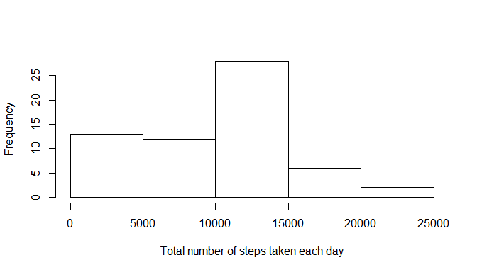
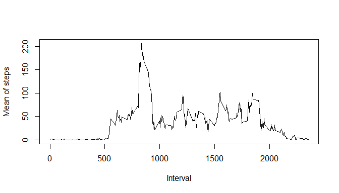
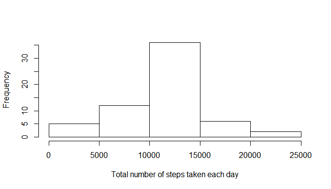
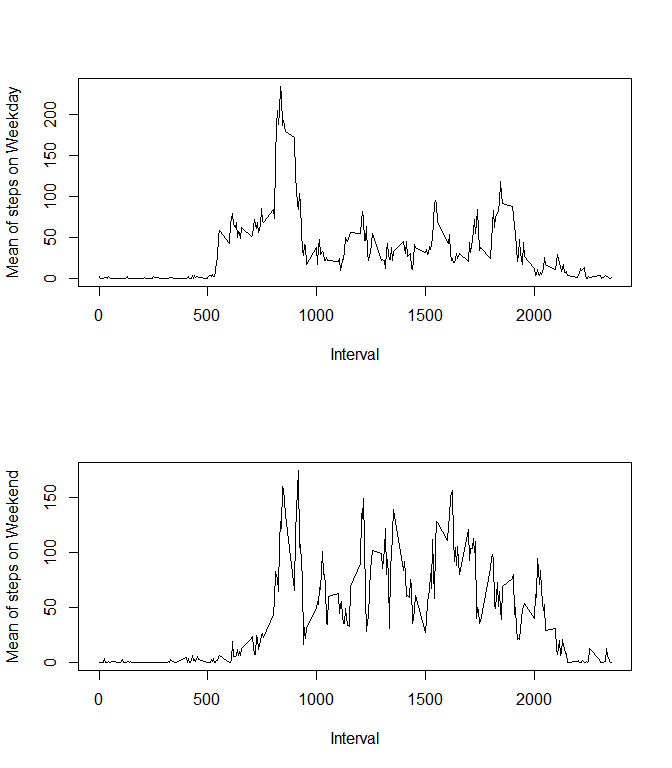

# Reproducible Research - Course Project 1
Juan Lopez Martin  

## Loading and preprocessing the data

First, I will load the data.


```r
activity <- read.csv("activity.csv", header = T)
```

## What is mean total number of steps taken per day?

Here I report the mean.


```r
library(stats)
library(plyr)

# Creating a new data.frame with the means of each day will be very useful for oncoming analysis. Also, this step allows us to explore what were the most active days or contrast different dates based on activity reports.
StepsPerDay <- ddply(activity, .(date), summarize, mean = mean(steps, na.rm = TRUE))

# Here  I calculate the mean of the previous data.frame. Note that the result is equal to the easier command 'mean(activity$steps)', but that is because in this case each day had the same number of intervals. If this would not be the case, the process I used computes a date-weighted mean.
mean(StepsPerDay$mean, na.rm = TRUE)
```

```
## [1] 37.3826
```

And the median.


```r
# The previous process is repeated but using the median instead.
StepsPerDay2 <- ddply(activity, .(date), summarize, median = median(steps, na.rm = TRUE))
median(StepsPerDay2$median, na.rm = TRUE)
```

```
## [1] 0
```

This is an histogram of the total number of steps taken each day.


```r
StepsPerDay.Sum <- ddply(activity, .(date), summarize, sum = sum(steps, na.rm = TRUE))
hist(StepsPerDay.Sum$sum, main="", xlab="Total number of steps taken each day")
```

<!-- -->

## What is the average daily activity pattern?

Here is a plot of the mean of steps per interval.


```r
## With the method used above, I create a new data.frame with the means of each interval.
StepsPerInterval <- ddply(activity, .(interval), summarize, mean = mean(steps, na.rm = TRUE))

# Plot that new data.frame.
plot(mean ~ interval, type="l", data = StepsPerInterval, xlab = "Interval", ylab = "Mean of steps")
```

<!-- -->

This is the 5-minute interval which, on average, contains the maximum number of steps.


```r
which.max(StepsPerInterval$mean)
```

```
## [1] 104
```

## Imputing missing values

The total number of missing values in the dataset is:


```r
# Number of NAs in 'steps' column.
sum(is.na(activity$steps))
```

```
## [1] 2304
```

Here I fill all the missing values in the dataset with the mean for that 5-minute interval, creating a new data.frame named 'activity.FilledNAs'.


```r
# The NAs on the 'steps' column are replaced by the mean of the corresponding interval. Thus, a new data.frame is created with the NAs filled in.
library(dplyr)
activity.FilledNAs <- activity
for (i in 1:length(activity.FilledNAs[ ,1]))
      if (is.na(activity.FilledNAs[i,1])) {
            activity.FilledNAs[i,1] <- filter(StepsPerInterval, interval == factor(activity.FilledNAs[i, 3]))$mean}

#First rows of the new data.frame.
head(activity.FilledNAs)
```

```
##       steps       date interval
## 1 1.7169811 2012-10-01        0
## 2 0.3396226 2012-10-01        5
## 3 0.1320755 2012-10-01       10
## 4 0.1509434 2012-10-01       15
## 5 0.0754717 2012-10-01       20
## 6 2.0943396 2012-10-01       25
```

With 'activity.FilledNAs', I make a histogram of the total number of steps taken each day and report the mean and median total number of steps taken per day.


```r
# Mean. Note that 'na.rm=TRUE' is not required because all NAs have been replaced.
mean(activity.FilledNAs$steps)
```

```
## [1] 37.3826
```

```r
# Median.
median(activity.FilledNAs$steps)
```

```
## [1] 0
```

```r
# Histogram.
StepsPerDay.FilledNAs <- ddply(activity.FilledNAs, .(date), summarize, sum = sum(steps, na.rm = TRUE))
hist(StepsPerDay.FilledNAs$sum, main="", xlab="Total number of steps taken each day")
```

<!-- -->

## Are there differences in activity patterns between weekdays and weekends?

Here, I make a time series plot  of the 5-minute interval and the average number of steps taken, averaged across all weekday days or weekend days.


```r
# My default time settings are in Spanish, so I have to change them to English.
Sys.setlocale("LC_TIME", "C")
```

```
## [1] "C"
```

```r
# Dates (which were initialy coded as 'character') had to be converted into a suitable data type.
activity$date <- as.Date(activity$date, "%Y-%m-%d")

# First, I create a new factor indicating the weekday of each date. Based on that, another factor is generated with two levels: 'weekday' or 'weekend'.
activity$day <- weekdays(activity$date)
activity$weekday <- factor(activity$day %in% c("Monday", "Tuesday", "Wednesday", "Thursday", "Friday"),levels=c(FALSE, TRUE), labels=c("weekend", "weekday"))

# In the process I just have described, two columns have been added to the activity data.frame.
head(activity)
```

```
##   steps       date interval    day weekday
## 1    NA 2012-10-01        0 Monday weekday
## 2    NA 2012-10-01        5 Monday weekday
## 3    NA 2012-10-01       10 Monday weekday
## 4    NA 2012-10-01       15 Monday weekday
## 5    NA 2012-10-01       20 Monday weekday
## 6    NA 2012-10-01       25 Monday weekday
```

```r
# Finally, I create the plots.
par(mfrow=c(2,1)) 

# I use the same function as in the 'daily pattern' section, but this time I filter the input so only the 'means of steps per interval on weekdays' are calculated.
StepsPerInterval.Wday <- ddply(filter(activity, weekday == "weekday"), .(interval), summarize, mean = mean(steps, na.rm = TRUE))
plot(mean ~ interval, type="l", data = StepsPerInterval.Wday, xlab = "Interval", ylab = "Mean of steps on Weekday")

# Same as above, but referring to weekends.
StepsPerInterval.Wend <- ddply(filter(activity, weekday == "weekend"), .(interval), summarize, mean = mean(steps, na.rm = TRUE))
plot(mean ~ interval, type="l", data = StepsPerInterval.Wend, xlab = "Interval", ylab = "Mean of steps on Weekend")
```

<!-- -->
